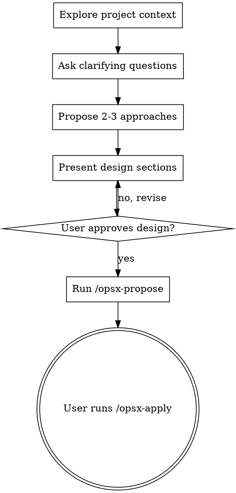

# Brainstorming Ideas Into Designs

## Overview

Help turn ideas into fully formed designs and specs through natural collaborative dialogue.

Start by understanding the current project context, then ask questions one at a time to refine the idea. Once you understand what you're building, present the design and get user approval.

<HARD-GATE>
Do NOT invoke any implementation skill, write any code, scaffold any project, or take any implementation action until you have presented a design and the user has approved it. This applies to EVERY project regardless of perceived simplicity.
</HARD-GATE>

## Anti-Pattern: "This Is Too Simple To Need A Design"

Every project goes through this process. A todo list, a single-function utility, a config change — all of them. "Simple" projects are where unexamined assumptions cause the most wasted work. The design can be short (a few sentences for truly simple projects), but you MUST present it and get approval.

## Checklist

You MUST create a task for each of these items and complete them in order:

1. **Explore project context** — check files, docs, recent commits
2. **Ask clarifying questions** — one at a time, understand purpose/constraints/success criteria
3. **Propose 2-3 approaches** — with trade-offs and your recommendation
4. **Present design** — in sections scaled to their complexity, get user approval after each section
5. **Create OpenSpec change** — use `/opsx-propose` to create proposal.md + design.md + tasks.md (NOT docs/plans/)
6. **Transition to implementation** — user runs `/opsx-apply` to start implementing

## Process Flow



**The terminal state is invoking `/opsx-propose`.** Do NOT invoke writing-plans, frontend-design, mcp-builder, or any other implementation skill. After brainstorming, use OpenSpec to create the change.

## The Process

**Understanding the idea:**
- Check out the current project state first (files, docs, recent commits)
- Ask questions one at a time to refine the idea
- Prefer multiple choice questions when possible, but open-ended is fine too
- Only one question per message - if a topic needs more exploration, break it into multiple questions
- Focus on understanding: purpose, constraints, success criteria

**Exploring approaches:**
- Propose 2-3 different approaches with trade-offs
- Present options conversationally with your recommendation and reasoning
- Lead with your recommended option and explain why

**Presenting the design:**
- Once you believe you understand what you're building, present the design
- Scale each section to its complexity: a few sentences if straightforward, up to 200-300 words if nuanced
- Ask after each section whether it looks right so far
- Cover: architecture, components, data flow, error handling, testing
- Be ready to go back and clarify if something doesn't make sense

## After the Design

**Documentation (使用 OpenSpec):**
- 使用 `/opsx-propose` 创建 change，自动生成 proposal.md + design.md + tasks.md
- **不要**在 `docs/plans/` 下创建文件
- **不要**手动创建 markdown 计划文件
- OpenSpec 会自动管理所有 artifacts

**Implementation:**
- 用户运行 `/opsx-apply` 开始实现
- **不要**调用 writing-plans skill（已由 OpenSpec 替代）

## Key Principles

- **One question at a time** - Don't overwhelm with multiple questions
- **Multiple choice preferred** - Easier to answer than open-ended when possible
- **YAGNI ruthlessly** - Remove unnecessary features from all designs
- **Explore alternatives** - Always propose 2-3 approaches before settling
- **Incremental validation** - Present design, get approval before moving on
- **Be flexible** - Go back and clarify when something doesn't make sense

## 架构图/图示输出规范

**必须**在 brainstorming 完成后生成架构图到 Obsidian。图示是设计的标准交付物，不是可选项。

### 存储位置

- **位置**: `C:\Users\30262\Documents\my-llm-wiki\my-llm-wiki\Excalidraw\`
- **格式**: `.canvas` (Obsidian JSON Canvas)
- **工具**: 使用 `diagram` skill 生成

### 目录结构

```
Excalidraw/
└── {项目名}/                    ← 大项目
    ├── 01-项目架构总览.canvas   ← 整体架构
    └── {change-name}/           ← 子决策 (与 openspec change 同名)
        ├── 01-核心循环.canvas
        ├── 02-模块依赖.canvas
        └── 03-任务分解.canvas
```

### 关键规则

1. **对应关系**: 子目录名 = openspec change 名（如 `MC-Bot/` 对应 openspec change `mc-bot`）
2. **分层**: 项目总览放顶层，change 详情放子目录
3. **间距**: 节点之间至少 50px，避免太紧凑
4. **分组**: 用 `group` 节点组织相关内容，带颜色标签
5. **颜色**: 预设颜色含义一致 (1=红=必做, 3=黄=警告, 4=绿=完成, 5=青=标题, 6=紫=可选)
6. **图和说明不分开**: 图就是图，不要在图下面加说明段落。如果非要放文字说明，放在图的旁边（作为图的一部分），不要单独成段

详细规范见 `AGENTS.md` → "架构图/图示规范" 章节。

## 常见错误（必须避免）

### 错误 1: 没有使用 OpenSpec

**症状**: 直接在 `docs/plans/` 下创建设计文档，或手动写 markdown 计划文件。

**原因**: 没有仔细读 SKILL.md，只看了摘要就开始工作。

**正确做法**: 
- 必须使用 `/opsx-propose` 创建 OpenSpec change
- OpenSpec 会自动生成 proposal.md + design.md + tasks.md
- 设计文档在 `openspec/changes/{name}/` 下，不在 `docs/plans/`

### 错误 2: 流程图位置错误

**症状**: 在项目目录下创建 `Excalidraw/` 文件夹，或在错误的位置创建子目录。

**原因**: 没有检查现有的 Excalidraw 目录结构。

**正确做法**:
- 先检查 `C:\Users\30262\Documents\my-llm-wiki\my-llm-wiki\Excalidraw\` 下已有的项目结构
- 子项目放在对应的父项目目录下（如 `Animetta/MC-Bot/`）
- 不要在顶层创建重复的项目目录

### 错误 3: 流程图节点尺寸太小

**症状**: 节点宽度 < 200px，高度 < 60px，导致文字换行过多、显示拥挤。

**原因**: 没有参考 AGENTS.md 中的尺寸规范。

**正确做法**:
- 文本节点: 250-300px 宽，80-100px 高
- 分组节点: 包含子节点 + 25px padding
- 节点间距: 至少 50px

### 错误 4: 编号冲突

**症状**: 新建的 canvas 文件与已有文件编号重复。

**原因**: 没有先检查目录下已有的文件。

**正确做法**:
- 先 `read` 目录，查看已有文件的编号
- 新文件从下一个可用编号开始
- 如果是补充设计，可以用 02, 03, 04... 继续编号
