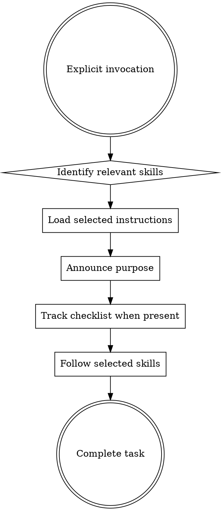

# Using Superpowers

This is an opt-in workflow primer. Invoke it only when the user explicitly asks
for `using-superpowers`; its presence does not trigger itself and does not make
every available skill mandatory.

## Workflow

While this primer is active:

## Skill Priority

When this primer is explicitly active and multiple skills are relevant:

1. Use process skills first because they determine the working method.
2. Use implementation skills next for the relevant domain.
3. Follow rigid skills such as TDD exactly; adapt flexible pattern skills to the task.

User and repository instructions continue to determine which skills are mandatory.
