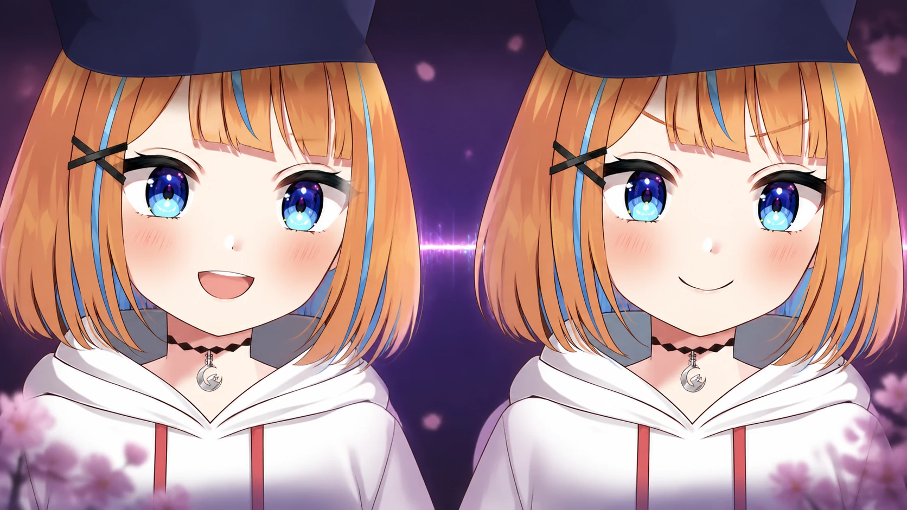

<p align="center">
  <h1 align="center">🤖 Animetta — AI Virtual Companion / VTuber Framework</h1>
  <p align="center">
    A configurable, extensible AI companion framework.<br>
    Plugin architecture · LangGraph orchestration · Hybrid memory · Live2D-driven · Multimodal interaction
  </p>
  <p align="center">
    <a href="README.zh-CN.md">简体中文</a> &nbsp;|&nbsp; <strong>English</strong>
  </p>
  <p align="center">
    
    
    
    
    
    
  </p>
</p>



Animetta is an open-source framework for building **AI virtual companions and VTubers** — characters that talk, listen, remember, emote through a Live2D avatar, and act in the world (chat, livestream, Minecraft). It orchestrates ASR → LLM → TTS → emotion as a single LangGraph state machine, with swappable `@ProviderRegistry` providers, hybrid memory (Chroma + SQLite FTS5 + Markdown wiki), a Vue 3 / Electron desktop app, and full-chain observability.

> **Why Animetta?** Most "AI VTuber" projects hardcode one provider pipeline. Animetta makes every layer — LLM, ASR, TTS, VAD, memory, tools — a swappable plugin via `@ProviderRegistry`, with full observability built in.

## Contents

- [Highlights](#-highlights)
- [Architecture](#-architecture)
- [Codebase Tour](#-codebase-tour)
- [Quick Start](#-quick-start)
- [Core Modules](#-core-modules)
- [Project Structure](#-project-structure)
- [Extending](#-extending)
- [Documentation](#-documentation)
- [Contributing](#-contributing)
- [Tech Stack](#-tech-stack)
- [License](#-license)

---

## ✨ Highlights

Animetta is not just another "ChatGPT + TTS" glue. It is an **engineered AI companion framework** built around three principles: **configurable, observable, extensible**.

- **LangGraph state-graph orchestration** — not a linear pipeline, but a directed graph with conditional routing, tool-calling loops, and interrupt/resume.
- **Plugin provider architecture** — register new vendors via the `@ProviderRegistry` decorator, zero core-code intrusion.
- **Hybrid memory system** — Chroma vector search (70%) + SQLite FTS5 keyword match (30%) + Markdown wiki knowledge base.
- **Live2D emotion-driven** — LLM output → emotion analysis → Live2D parameter mapping; expressions change in real time with the conversation.
- **Full-chain observability** — OpenTelemetry distributed tracing + Prometheus metrics + built-in Stats Dashboard.

---

## 🏗️ Architecture

```
┌──────────────────────────────────────────────────────────────────┐
│                      Frontend (Vue 3 + Vite)                      │
│               Live2D Renderer · Chat UI · Stats Dashboard         │
└─────────────────────────────┬────────────────────────────────────┘
                              │ Socket.IO / REST
┌─────────────────────────────▼────────────────────────────────────┐
│                WebSocket Server (Starlette + Socket.IO ASGI)      │
│               Session Mgmt · Desktop App · Live2D Events          │
└─────────────────────────────┬────────────────────────────────────┘
                              │
┌─────────────────────────────▼────────────────────────────────────┐
│                   LangGraph Orchestration Engine                   │
│                                                                   │
│  ┌─────────┐   ┌─────────┐   ┌──────────┐   ┌──────────────┐    │
│  │ ASR Node│ → │ Persona │ → │ LLM Node │ → │ Emotion Node │    │
│  │         │   │  Node   │   │  + RAG   │   │ → Live2D Map │    │
│  └─────────┘   └─────────┘   └────┬─────┘   └──────────────┘    │
│                                  │                                │
│                          ┌───────▼───────┐   ┌─────────────┐     │
│                          │  Tool Node   │   │ Output Node │     │
│                          │ MC/MCP/Custom│   │TTS + Memory │     │
│                          └──────────────┘   └─────────────┘     │
└───────────────────────────────────────────────────────────────────┘
                              │
         ┌────────────────────┼────────────────────┐
         ▼                    ▼                    ▼
┌───────────────┐   ┌───────────────┐   ┌───────────────┐
│   Services    │   │    Memory     │   │   Tracing     │
│ LLM/ASR/TTS   │   │Chroma+SQLite  │   │ OTel + Stats  │
│ Live2D / VAD  │   │+ Wiki + Meme  │   │+ Prometheus   │
└───────────────┘   └───────────────┘   └───────────────┘
```

> Deeper architecture detail: [docs/architecture/overview.md](docs/architecture/overview.md).

### Architecture map

The codebase decomposes into 15 layers across four areas (node counts from the architecture knowledge graph):

**Backend runtime**

| Layer | What it covers | Key paths |
|-------|----------------|-----------|
| LangGraph Orchestration (63) | The state-graph engine — nodes, Starlette + Socket.IO ASGI server, prompting sources, routes. The only orchestration mechanism in the project. | [`src/animetta/orchestration/`](src/animetta/orchestration/) |
| Provider Services (129) | Swappable LLM / ASR / TTS / VAD / singing providers following interface → implementation → factory → export with `@ProviderRegistry`. | [`src/animetta/services/`](src/animetta/services/) |
| Product Tools & Minecraft (142) | Runtime product tools (incl. the Node.js Minecraft adapter) and MCP client integration exposed to the orchestrator. | [`src/animetta/tools/`](src/animetta/tools/) |
| Persona & Effective Config (64) | Persona definitions and the EffectiveConfig / registry that resolves runtime configuration. | [`src/animetta/config/`](src/animetta/config/) |
| Memory & Live2D Avatar (32) | Hybrid memory (Chroma vector + SQLite FTS5 + wiki, per ADR-005) and the Live2D avatar / emotion mapping domain. | [`src/animetta/memory/v2/`](src/animetta/memory/v2/) · [`src/animetta/avatar/`](src/animetta/avatar/) |
| Backend Platform Core (70) | Cross-cutting foundations: shared runtime core, observability/tracing, inspection, notifier, utils, acceptance, and host TTS/RVC contracts. | [`src/animetta/core/`](src/animetta/core/) · [`src/animetta/observability/`](src/animetta/observability/) |
| Backend Package & External Hosts (10) | Backend package roots and host-side service packages (Qwen TTS, RVC host) that run on the Windows host, not in containers. | [`src/animetta_qwen_tts/`](src/animetta_qwen_tts/) · [`src/animetta_rvc_host/`](src/animetta_rvc_host/) |

**Frontend**

| Layer | What it covers | Key paths |
|-------|----------------|-----------|
| Frontend Application (138) | Vue 3 + Vite application code: components, views, stores, router, composables, Live2D perf, and feature modules (live streaming, Minecraft gameplay, review, TTS failover). | [`frontend/src/`](frontend/src/) |
| Frontend Assets (56) | Static public assets bundled with the desktop app — Live2D models, backgrounds, danmaku test data. | [`frontend/public/`](frontend/public/) |
| Frontend Shell & Build (54) | Electron main/preload, sites worker, build/smoke scripts, and Vite/Uno/tsconfig/Electron-builder configuration plus entry HTML. | [`frontend/electron/`](frontend/) · [`frontend/scripts/`](frontend/scripts/) |

**Configuration & infrastructure**

| Layer | What it covers | Key paths |
|-------|----------------|-----------|
| Runtime Configuration (30) | Declarative runtime configuration: personas, features, demo data, program scripts, plus root manifests and environment templates. | [`config/`](config/) · [`.env.example`](.env.example) |
| Infrastructure & CI/CD (22) | Container definitions, Compose topology, GitHub Actions pipelines, and host-side observability stack config. | [`docker/`](docker/) · [`observability/`](observability/) · [`.github/workflows/`](.github/workflows/) |

**Developer surface**

| Layer | What it covers | Key paths |
|-------|----------------|-----------|
| Dev Tooling & Scripts (78) | Quality planner, dev-agent MCP servers, and the runtime lifecycle / operational scripts. | [`tooling/`](tooling/) · [`scripts/`](scripts/) |
| Evaluations & Contracts (28) | Evaluation harnesses/fixtures and interface contracts (gamebot, Minecraft). | [`evaluations/`](evaluations/) · [`contracts/`](contracts/) |
| Project Skills & Docs (17) | In-repo agent skills and top-level documentation. | [`.agents/skills/`](.agents/skills/) · [`docs/`](docs/) |

---

## 🗺️ Codebase Tour

A ten-step reading path through the actual code, from boot to deep internals:

1. **Project Overview** — Start here: this README plus [docs/architecture/overview.md](docs/architecture/overview.md) for the purpose and shape of the system.
2. **Frontend Entry Point** — [`frontend/src/main.ts`](frontend/src/main.ts) mounts the Vue 3 app (Vite + Electron); [`frontend/src/App.vue`](frontend/src/App.vue) wires the shell that hosts the Live2D renderer, chat UI, and dashboard.
3. **The LangGraph Orchestration Engine** — The heart of the backend. [`orchestrator.py`](src/animetta/orchestration/graph/orchestrator.py) builds the directed state graph with conditional routing and tool-calling loops; [`state.py`](src/animetta/orchestration/graph/state.py) defines the shared `AgentState` that flows ASR → Persona → LLM → Emotion; [`llm_node.py`](src/animetta/orchestration/graph/llm_node.py) is where generation happens.
4. **Prompts & Persona** — [`prompting/sources.py`](src/animetta/orchestration/prompting/sources.py) assembles the persona- and guard-aware system prompt; [`config/__init__.py`](src/animetta/config/__init__.py) loads character definitions and the EffectiveConfig that parameterizes every node.
5. **Realtime Server (Starlette + Socket.IO)** — The ASGI server bridges frontend and orchestrator: [`websocket.py`](src/animetta/orchestration/server/websocket.py) manages sessions and streams events; [`routes.py`](src/animetta/orchestration/server/routes.py) declares the Socket.IO/REST route handlers.
6. **Swappable Provider Services** — Every capability is a plugin via `@ProviderRegistry`. The package roots expose the LLM, TTS, and ASR provider factories (interface → implementation → factory → export): [`services/llm/`](src/animetta/services/llm/) · [`services/tts/`](src/animetta/services/tts/) · [`services/asr/`](src/animetta/services/asr/).
7. **Hybrid Memory** — Memory v2 (ADR-005): [`memory/v2/context.py`](src/animetta/memory/v2/context.py) blends Chroma vector search, SQLite FTS5 keyword match, and a Markdown wiki knowledge base for long-term recall.
8. **Product Tools — Minecraft** — The Minecraft adapter is a Node.js project living inside the Python repo, exposing world actions to the orchestrator as callable tools: [`tools/minecraft/`](src/animetta/tools/minecraft/).
9. **Live2D Avatar & Emotion** — LLM emotion output is parsed and mapped to Live2D parameters in [`avatar/performance.py`](src/animetta/avatar/performance.py), driving expressions in real time alongside the conversation.
10. **Configuration & Tool Registry** — Declarative anchors: [`pyproject.toml`](pyproject.toml) pins the Python 3.13 backend; [`config/tools.yaml`](config/tools.yaml) registers the product tools the orchestrator may call.

---

## 🚀 Quick Start

### Prerequisites

- **Python 3.13** (the toolchain targets 3.13 via ruff/mypy)
- **Node.js 20+** and **pnpm** (frontend)
- _(optional)_ NVIDIA GPU + [nvidia-container-toolkit](https://docs.nvidia.com/datacenter/cloud-native/container-toolkit/install-guide.html) for GPU mode

### 1. Install dependencies

```bash
pip install -r requirements.txt
cd frontend && pnpm install
```

### 2. Configure

Edit `config/animetta.yaml` to choose the persona and the complete provider map for the `test`, `smoke`, and `production` profiles. Provider selection lives only in this manifest; environment variables supply profile, endpoints, and secrets.

```bash
cp .env.example .env
# Choose test, smoke, or production and fill only the keys it needs:
#   ANIMETTA_PROFILE="test"
#   DEEPSEEK_API_KEY="..."
#   DASHSCOPE_API_KEY="..."
#   MIMO_API_KEY="..."
#   QWEN_TTS_API_KEY="..."
```

### 3. Run

```bash
# Backend
python -m animetta.core.socketio_server

# Frontend (in a second terminal)
cd frontend && pnpm dev
```

The frontend dev server runs on `http://localhost:3000`; the backend on `http://localhost:12394`.

### Build and run the personal edition (recommended)

```bash
# Start or reuse host-local Qwen, then build and start Animetta
py -3.13 scripts/runtime_lifecycle.py anima-up
```

This is the single build entrypoint for routine personal use. CI and acceptance
runs select `smoke` or `selftest` through `ANIMETTA_PROFILE` while reusing the
same Compose file.

Routine `py -3.13 scripts/runtime_lifecycle.py anima-down` leaves the host Qwen
process and its loaded model running. Use `host-tts-stop` only when GPU memory must
be released. Qwen is not built or managed as a Docker container.

Once healthy, the frontend is served by nginx on **port 80** and the backend health endpoint is at `http://localhost:12394/health` (also proxied at `http://localhost/health`).

> Full deployment guides: [Docker](docs/deployment/docker.md) · [Zeabur](docs/deployment/zeabur.md)

---

## 🔧 Core Modules

| Module | What it does | Docs |
|--------|--------------|------|
| **LangGraph engine** | Directed-graph orchestration with conditional routing, tool loops, interrupt/resume | [docs/architecture/overview.md](docs/architecture/overview.md) |
| **Provider plugins** | Register LLM/ASR/TTS/VAD/Singing vendors via `@ProviderRegistry` | [docs/reference/tools.md](docs/reference/tools.md) |
| **Hybrid memory** | Chroma (70%) + SQLite FTS5 (30%) + Markdown wiki + meme learner | ADR-002, ADR-005 |
| **Live2D emotion** | LLM → emotion tag → Live2D param mapping (6 base emotions) | ADR-009 |
| **Minecraft bot** | Mineflayer-based bot, decoupled external Voyager runtime | [docs/development/minecraft-bot-architecture.md](docs/development/minecraft-bot-architecture.md) |
| **Observability** | OpenTelemetry traces + Prometheus metrics + Stats Dashboard | ADR-006 |

**Supported providers:**

| Type | Providers |
|------|-----------|
| **LLM** | OpenAI · GLM (Zhipu) · Ollama · DeepSeek · Mock |
| **ASR** | OpenAI Whisper · GLM ASR · Mock |
| **TTS** (core) | Edge · MiMo · Qwen3 · GPT-SoVITS · Mock |
| **TTS** (contrib) | GLM · ChatTTS · Kokoro · VibeVoice |
| **VAD** | Silero VAD |

> Socket.IO event catalog and API reference live in [docs/reference/](docs/reference/).

---

## 📁 Project Structure

```
animetta/
├── src/animetta/          # Python backend (Starlette + LangGraph + Socket.IO)
│   ├── core/              # Entry point + service container
│   ├── orchestration/     # LangGraph state graph + WebSocket server
│   ├── services/          # LLM / ASR / TTS / VAD / Singing / Meme / Live2D
│   ├── memory/            # V2 atom-based memory (Chroma + SQLite FTS5)
│   ├── tools/             # Tool calling + MCP bridge + Minecraft bot
│   ├── avatar/            # Live2D emotion/expression analysis
│   ├── config/            # Pydantic configs + provider registry
│   ├── tracing/           # OpenTelemetry observability
│   ├── notifier/          # Alert channels (Discord, Feishu, Email)
│   ├── inspection/        # Health / telemetry background checks
│   └── acceptance/        # Golden soak state machine
├── frontend/              # Vue 3 + TypeScript + Vite (Electron desktop)
├── config/                # YAML config files (personas, services, tools)
├── design-system/         # Visual design spec (HTML spec sheets)
├── docs/                  # Architecture, ADRs, deployment, references
└── tests/                 # pytest (backend) + vitest (frontend)
```

---

## 🧩 Extending

**Add a provider** (LLM/ASR/TTS/VAD):

```python
# 1. Create a config class
@ProviderRegistry.register("llm", "my_llm")
class MyLLMConfig(BaseLLMConfig):
    api_key: str

# 2. Register the service
@ProviderRegistry.register_service("llm", "my_llm")
class MyLLMAgent(AgentInterface):
    @classmethod
    def from_config(cls, config, **kwargs):
        return cls(api_key=config.api_key)
```

**Add a graph node** — follow the node pattern in [`src/animetta/orchestration/graph/`](src/animetta/orchestration/graph/).

**Add a tool** — use the `@tool` decorator in [`src/animetta/tools/`](src/animetta/tools/).

> Agent conventions (for Codex / ZCode): see [AGENTS.md](AGENTS.md).

---

## 📚 Documentation

| Topic | Location |
|-------|----------|
| Architecture overview | [docs/architecture/overview.md](docs/architecture/overview.md) |
| Architecture Decision Records (11) | [docs/adrs/](docs/adrs/) |
| Backend & Socket.IO API reference | [docs/reference/](docs/reference/) |
| Testing guide | [docs/development/testing.md](docs/development/testing.md) |
| Deployment (Docker / Zeabur) | [docs/deployment/](docs/deployment/) |
| Design system | [design-system/](design-system/) |
| Doc navigation index | [docs/README.md](docs/README.md) |

---

## 🤝 Contributing

See [CONTRIBUTING.md](CONTRIBUTING.md) for development setup, code standards, and test commands.

---

## 📊 Tech Stack

| Layer | Technology |
|-------|------------|
| **Orchestration** | LangGraph · LangChain |
| **Backend** | Starlette · Socket.IO ASGI |
| **Frontend** | Vue 3 · Vite · TypeScript · Pinia · UnoCSS · pixi.js · Live2D Cubism SDK · Electron |
| **Memory** | ChromaDB · SQLite FTS5 · Markdown Wiki |
| **Tracing** | OpenTelemetry · Prometheus · Langfuse |
| **AI** | OpenAI · Zhipu GLM · DeepSeek · Ollama · Whisper · Qwen3-TTS · GPT-SoVITS |
| **Audio** | Demucs · GPT-SoVITS · RVC · yt-dlp |
| **Game** | Mineflayer (Node.js) |

---

## 📄 License

[MIT License](LICENSE) — Copyright (c) 2026 Cowork
