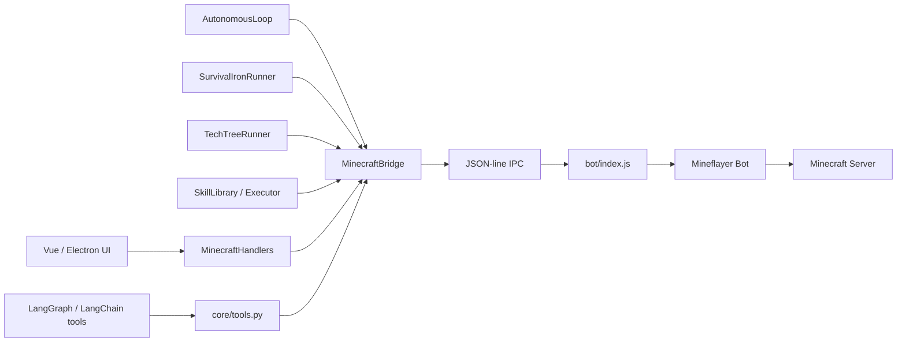
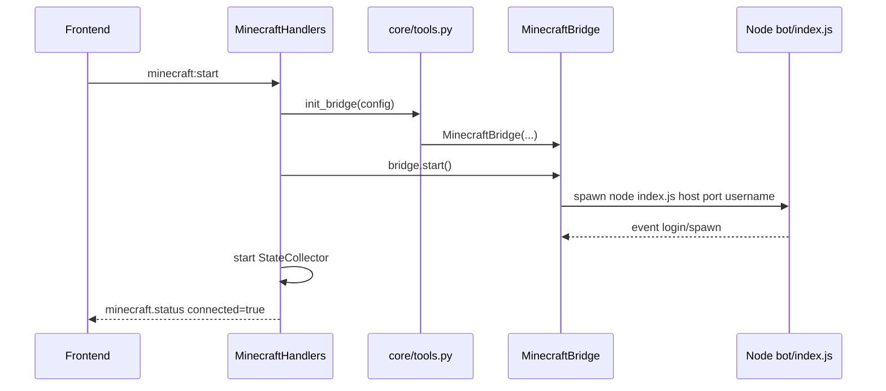
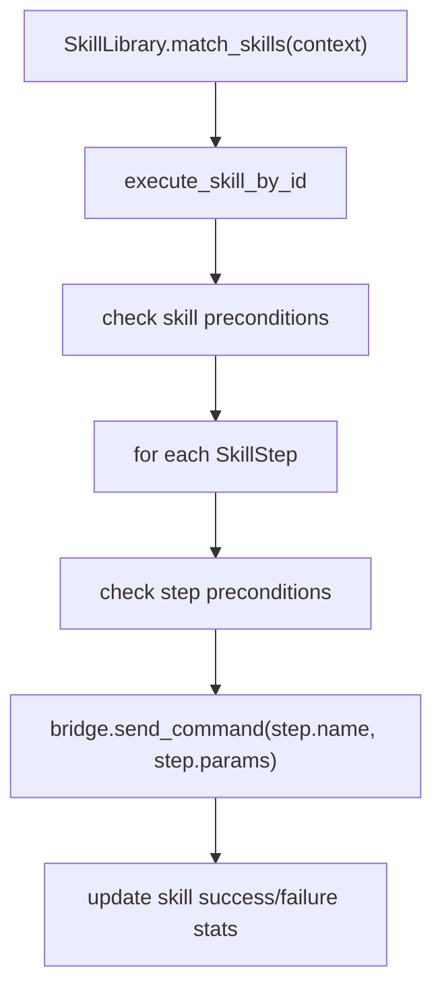

# Minecraft Bot Architecture

> Last updated: 2026-06-28
>
> This document explains the current Minecraft bot implementation in Animetta.
> The short version: Python decides, stores state, exposes tools, and runs
> higher-level loops; Node.js owns the live Mineflayer bot and executes concrete
> in-game actions.

## Mental Model

The Minecraft module is not one single bot loop. It is a stack of cooperating
layers that all converge on the same JSON-line bridge:



Everything that touches the actual Minecraft world eventually becomes:

```json
{"id": 1, "action": "collect", "params": {"block_type": "oak_log", "count": 5}}
```

Node replies with:

```json
{"id": 1, "status": "success", "result": "Collected 5 oak_log"}
```

or:

```json
{"id": 1, "status": "error", "result": {"message": "No recipes for diamond_pickaxe", "code": "NO_RECIPE"}}
```

## Directory Map

| Path | Role |
| --- | --- |
| `src/animetta/tools/minecraft/core/` | Python bridge, config, LangChain tool registration, HUD state collection |
| `src/animetta/tools/minecraft/bot/` | Node.js Mineflayer process and concrete action handlers |
| `src/animetta/tools/minecraft/bot/behaviors/` | Node-side auto-eat, combat guard, plan executor |
| `src/animetta/tools/minecraft/autonomous/` | Python-side autonomous decision loop, rules engine, LLM planner |
| `src/animetta/tools/minecraft/skill/` | Voyager-style skill models, library, executor, extractor, validator |
| `src/animetta/tools/minecraft/survival/` | Deterministic wood-to-iron survival state machine |
| `src/animetta/tools/minecraft/tech_tree/` | Longer benchmark/progression runner built around phases and milestones |
| `src/animetta/tools/minecraft/benchmark/` | Scenario metrics and reports |
| `src/animetta/tools/minecraft/other/` | World-state parsing, trace recording, one-off scripts and experiments |
| `tests/tools/minecraft/` | Python tests for bridge, autonomous loop, skills, survival, tech tree |

## Startup Paths

There are two important ways the bot is created.

### 1. Frontend Start Button



Main files:

- `src/animetta/orchestration/server/handlers/minecraft_handlers.py`
- `src/animetta/tools/minecraft/core/tools.py`
- `src/animetta/tools/minecraft/core/bridge.py`

Current caveat: `MinecraftHandlers.on_minecraft_start()` constructs
`MinecraftConfig(enabled=True, autonomous=True)` directly. That means frontend
startup is not yet fully driven by `config/tools.yaml`.

### 2. LangChain Tool Loading

`core/tools.py` exposes public `@tool` functions such as `mc_collect`,
`mc_craft`, `mc_status`, and `mc_survival_iron`.

These functions call `_send()`, which formats the bridge result for LLM
consumption:

```text
mc_collect("oak_log", 5)
  -> _send("collect", {"block_type": "oak_log", "count": 5})
  -> MinecraftBridge.send_command(...)
  -> Node action "collect"
```

## Bridge Layer

`MinecraftBridge` owns the Node subprocess lifecycle and the request/response
bookkeeping.

Key responsibilities in `core/bridge.py`:

- starts `node bot/index.js <host> <port> <username>`
- writes one JSON command per line to stdin
- reads stdout line-by-line and parses JSON responses
- matches response `id` to pending Python futures
- handles id-less events such as `login`, `spawn`, `heartbeat`,
  `viewer_joined`, and `viewer_left`
- starts/stops the Python autonomous loop when enabled
- forwards spectator viewer events to the backend callback

Important fields:

| Field | Meaning |
| --- | --- |
| `_process` | Async subprocess handle for Node |
| `_pending` | `id -> Future` waiting for command responses |
| `_next_id` | Monotonic command id counter |
| `_lock` | Protects id allocation |
| `_bot_ready` | Set when Node emits the `login` event |
| `_autonomous_loop` | Optional Python-side decision loop |

The bridge has a module-level singleton:

```python
from animetta.tools.minecraft.core.bridge import get_bridge
```

`core/tools.py` also stores a `_bridge`. The current implementation keeps those
two singleton references synchronized in `init_bridge()` and `cleanup_bridge()`.

## Node Bot Layer

`bot/index.js` is the live Mineflayer process. It owns the actual bot object:

```js
const bot = mineflayer.createBot({ host, port, username });
bot.loadPlugin(pathfinder);
bot.loadPlugin(pvp);
```

It contains three kinds of functions.

### Core Actions

These directly use Mineflayer:

| Function | Action |
| --- | --- |
| `_goto()` | Pathfind to a block position |
| `_mine()` / `_mineInner()` | Find and dig matching blocks |
| `_collect()` / `_collectInner()` | Mine and pick up dropped items |
| `_place()` | Place a block at coordinates |
| `_craft()` | Craft using inventory or nearby crafting table |
| `_attack()` | Attack nearest hostile/player/entity |
| `_waterBucketClutch()` | Equip water bucket, look down, activate item |
| `_recipes()` | Inspect available recipes |

Some actions have been split into modules:

| Module | Role |
| --- | --- |
| `smelt.js` | Furnace/smelting actions |
| `equip.js` | Equip item to hand/armor slots |
| `mine_shaft.js` | Controlled shaft mining |
| `sandbox.js` | Voyager `eval_code` sandbox and status snapshot |
| `spectator.js` | Auto-spectate viewer handling |
| `commandRuntime.js` | Timeout helper, response guard, busy bypass rules |

### IPC Command Handlers

`handleCommand()` maps bridge actions to handlers:

| Bridge action | Handler |
| --- | --- |
| `goto` | `handleGoto()` |
| `mine` | `handleMine()` |
| `collect` | `handleCollect()` |
| `craft` | `handleCraft()` |
| `smelt` | `handleSmelt()` |
| `status` | `handleStatus()` |
| `stop` | `handleStop()` |
| `set_mode` | `handleSetMode()` |
| `plan_status` | `handlePlanStatus()` |
| `eval_code` | `handleEvalCode()` |
| `equip` | `handleEquip()` |
| `mine_shaft` | `handleMineShaft()` |
| `water_bucket_clutch` | `handleWaterBucketClutch()` |

### Runtime Safety

`commandRuntime.js` protects the command channel:

- `createResponseGuard()` suppresses duplicate responses for the same id.
  This prevents logs like timeout followed by a late `Digging aborted` response
  for the same command.
- `withTimeout()` races long actions against a timeout and calls cleanup.
- `isBusyBypassAction()` allows `status`, `stop`, and `plan_status` while the bot
  is busy.

`index.js` also has `abortCurrentAction()`, which stops pathfinding, PVP,
digging, collect-block tasks, and then resumes auto systems.

## Status Shape

`status` is the most important read action. Node returns a dict used by the UI,
autonomous loop, survival runner, and skills.

Common fields:

| Field | Meaning |
| --- | --- |
| `position` | Current block position |
| `health`, `food` | Survival stats |
| `dimension`, `time`, `weather`, `biome` | Environment |
| `inventory` | Item name to count |
| `nearby_entities` | Hostile/player/passive/neutral summary |
| `fall_distance`, `on_ground`, `velocity` | Fall-risk detection |
| `current_goal` | Node-side idle goal |

Python parses this in `other/world_state.py`.

`WorldState` adds derived helpers:

- `get_threat_level()`
- `get_fall_risk_level()`
- `has_water_bucket`
- `get_material_gaps()`
- `distance_to()`

## Autonomous Loop

`autonomous/loop.py` is a Python perception-decision-action loop.

Every tick:

```text
status -> WorldState -> _evaluate() -> _execute()
```

Decision priority:

1. Fall safety: if falling and has water bucket, run `water_bucket_clutch`
2. Threat safety: attack nearby hostiles
3. Low health / night return
4. SkillLibrary match
5. Building material gaps
6. Proactive chat
7. Random exploration
8. Idle

The loop can be paused/resumed by the bridge when direct LLM instructions are
active.

If learning components are wired, successful autonomous actions are recorded by
`TraceRecorder`, extracted into skills by `SkillExtractor`, validated by
`SkillValidator`, and saved into `SkillLibrary`.

## Rules Engine

`autonomous/rules_engine.py` reads `rules.md` and turns it into a
`BehaviorRules` object.

It controls:

- bot character name/personality for behavior flavor
- priority order
- building target and required materials
- safety settings
- proactive chat topics and cooldown

The rules engine is deliberately lower authority than hard safety constraints.
For example, config-level safety can override weaker rules.

## Planner Mode

There are two planning systems:

### Python LLM Planner

`autonomous/planner.py` takes a natural-language goal and returns a list of
`PlanStep(action, params, description)`.

It first tries `SkillLibrary.search_skills()`. If no skill matches and an LLM
service exists, it asks the LLM for JSON.

### Node Plan Executor

`bot/behaviors/planExecutor.js` stores and steps through plans on the Node side.

Python switches Node into planner mode with:

```python
await bridge.set_planner_mode(plan_steps)
```

which sends:

```json
{"action": "set_mode", "params": {"mode": "planner", "plan": [...]}}
```

Node's plan loop then executes one step at a time through the same internal
handlers.

## Voyager-Style Skills

The skill system lives in `skill/`.

Core model:

```text
Skill
  id
  name
  description
  preconditions
  steps: list[SkillStep]
  body: optional code-body skill
  stats: success/fail/avg_duration
```

`SkillStep.name` must be one of:

```text
goto, smart_goto, collect, mine, place, smart_build, craft, chat,
check, wait, attack, smelt, water_bucket_clutch
```

Execution flow:



There are two skill types:

| Type | Execution |
| --- | --- |
| Step skill | Python executes each `SkillStep` via bridge commands |
| Code-body skill | Python sends JS to Node `eval_code`; Node runs it inside `sandbox.js` |

Built-in predefined skills are in `skill/predefined.py`; learned skills can be
persisted in SQLite via `SkillLibrary(db_path="data/mc_skills.db")`.

## Deterministic Survival Runner

`survival/runner.py` is separate from autonomous behavior. It is a deterministic
state machine for the wood-to-iron path.

Phase order:

```text
WOOD
CRAFTING_TABLE
WOODEN_PICKAXE
COBBLESTONE
STONE_KIT
FUEL
IRON_ORE
SMELT_IRON
IRON_GEAR
DONE
```

Each phase:

1. refreshes inventory through `status`
2. checks whether the phase goal is already met
3. sends explicit bridge commands such as `collect`, `craft`, `smelt`
4. retries within a phase-specific budget
5. maps structured errors to recovery actions
6. records a `PhaseResult`

This runner is exposed to the LLM as `mc_survival_iron()`.

Use it when you want repeatable survival progression rather than open-ended
autonomous behavior.

## Tech Tree Runner

`tech_tree/runner.py` is a longer benchmark/progression runner.

It differs from `SurvivalIronRunner` in two ways:

- it is milestone-based rather than hardcoded to only the iron path
- it tries to reuse `SkillLibrary` before falling back to raw bridge commands

Flow:

```text
for each TechTreePhase:
  for each task:
    try matching skill
    if skill fails or not found, send bridge command
    check inventory milestone
```

It produces `TechTreeMetrics` and markdown reports for benchmarking.

## Frontend and HUD

Frontend lifecycle is handled through `MinecraftHandlers`.

Relevant events:

| Event | Direction | Meaning |
| --- | --- | --- |
| `minecraft:start` | UI -> backend | Start bridge and Node bot |
| `minecraft:stop` | UI -> backend | Stop state collector and bridge |
| `minecraft:spectate` | UI -> backend | Attach viewer to bot perspective |
| `minecraft:command` | UI -> backend | Send raw bridge command |
| `minecraft.status` | backend -> UI | Connected/disconnected status |
| `minecraft.viewer_status` | backend -> UI | Viewer joined/left/error |
| `mc_bot_state` | backend -> UI | Periodic HUD/dashboard state |

`core/state_collector.py` polls `status` every few seconds and pushes:

- Minecraft HUD commands through bot chat commands
- Socket.IO state to the frontend

Known caveat: `StateCollector` currently asks for an `inventory` action, but
`bot/index.js` does not expose an `inventory` command in `handleCommand()`.
The collector still receives inventory from `status`, so this should be cleaned
up rather than relied on.

## Common Call Chains

### LLM asks bot to collect wood

```text
mc_collect("oak_log", 5)
  -> core/tools._send("collect", ...)
  -> MinecraftBridge.send_command("collect", ...)
  -> Node handleCommand("collect")
  -> handleCollect()
  -> _collect()
  -> Mineflayer pathfinder/dig/pickup
  -> JSON response to Python
  -> formatted text back to LLM
```

### Autonomous water-bucket clutch

```text
AutonomousLoop tick
  -> bridge status
  -> WorldState.get_fall_risk_level()
  -> fall_risk >= 2 and has water_bucket
  -> bridge.send_command("water_bucket_clutch", timeout=3)
  -> Node _waterBucketClutch()
```

### Survival iron run

```text
mc_survival_iron()
  -> SurvivalIronRunner.run()
  -> phase WOOD: collect oak_log
  -> phase CRAFTING_TABLE: craft planks/table
  -> ...
  -> phase IRON_GEAR: craft iron tools/armor
  -> RunReport -> markdown-like summary
```

### Learned skill execution

```text
AutonomousLoop / TechTreeRunner / direct SkillLibrary call
  -> SkillLibrary.execute_skill_by_id()
  -> execute_skill()
  -> bridge.send_command(each step)
  -> update success/failure stats
```

## What To Change Where

| Task | File(s) |
| --- | --- |
| Add a new low-level bot action | `bot/index.js`, optionally a new `bot/*.js` module |
| Add a bridge-exposed action | `bot/index.js::handleCommand()` and a handler |
| Add an LLM tool | `core/tools.py::get_minecraft_tools()` and new `@tool` |
| Add fields to `status` | Node `handleStatus()` plus `other/world_state.py` parser if Python needs it |
| Change autonomous priorities | `autonomous/loop.py::_evaluate()` |
| Change behavior rules | `rules.md` and `autonomous/rules_engine.py` |
| Add a reusable skill | `skill/predefined.py`, `skill/models.py` if a new step type is needed |
| Add a deterministic survival phase | `survival/models.py`, `survival/inventory.py`, `survival/runner.py`, recovery tests |
| Add benchmark/progression goals | `tech_tree/defaults.py`, `tech_tree/models.py`, tests |
| Fix frontend start/stop | `orchestration/server/handlers/minecraft_handlers.py` |

## Current Sharp Edges

These are worth keeping in mind while debugging:

- Frontend start currently hardcodes `MinecraftConfig(enabled=True, autonomous=True)`.
- There are multiple execution modes sharing one Node bot, so command-level
  timeouts and `busy` handling matter a lot.
- `status`, `stop`, and `plan_status` are allowed during busy periods; most
  other actions are rejected while another action is running.
- Node late responses are suppressed per request id, so a timeout should not
  produce a second error line for the same command.
- Some docs still lag behind current code. `survival/SKILLS.md` describes older
  busy behavior and older skill counts.
- `StateCollector` has an `inventory` command request that does not match the
  current Node command list.
- Code-body Voyager skills run JS in a restricted sandbox, but they still drive
  real bot actions. Treat generated skill code as behavior code, not plain data.

## Verification Commands

Useful checks after Minecraft bot changes:

```powershell
node --check src\animetta\tools\minecraft\bot\index.js
node --test src\animetta\tools\minecraft\bot\commandRuntime.test.js
$env:PYTHONPATH='src'; python -m pytest -o addopts='' tests/tools/minecraft -q
```

For full application verification after code changes, follow the project Docker
startup protocol from `AGENTS.md`.
