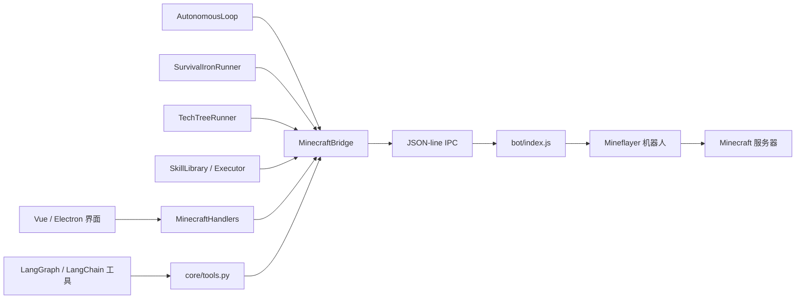
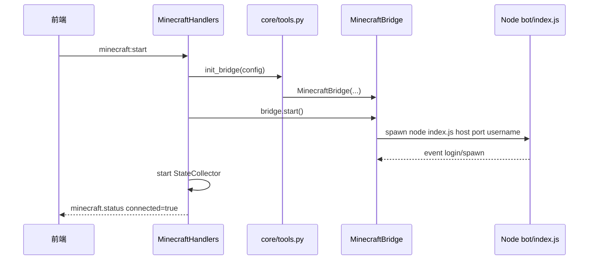
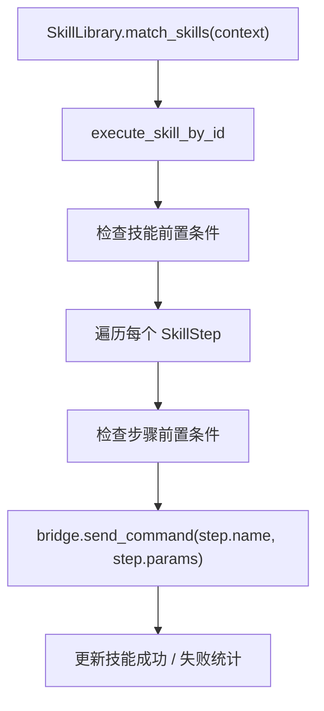

# Minecraft 机器人架构

> 最后更新：2026-06-28
>
> 本文档为 [`minecraft-bot-architecture.md`](minecraft-bot-architecture.md) 的中文翻译，技术术语与代码标识符保留原文以便对照。
>
> 本文档说明 Animetta 中当前 Minecraft 机器人的实现方式。
> 简而言之：Python 负责决策、状态存储、工具暴露以及高层循环；Node.js
> 持有实时 Mineflayer 机器人并执行具体的游戏内动作。

## 思维模型

Minecraft 模块并非单一机器人循环，而是一组相互协作的层，它们最终都汇聚到同一个 JSON-line 桥接层：



所有接触真实 Minecraft 世界的操作最终都会变成：

```json
{"id": 1, "action": "collect", "params": {"block_type": "oak_log", "count": 5}}
```

Node 用以下格式回复：

```json
{"id": 1, "status": "success", "result": "Collected 5 oak_log"}
```

或者：

```json
{"id": 1, "status": "error", "result": {"message": "No recipes for diamond_pickaxe", "code": "NO_RECIPE"}}
```

## 目录结构

| 路径 | 职责 |
| --- | --- |
| `src/animetta/tools/minecraft/core/` | Python 桥接层、配置、LangChain 工具注册、HUD 状态采集 |
| `src/animetta/tools/minecraft/bot/` | Node.js Mineflayer 进程及具体动作处理器 |
| `src/animetta/tools/minecraft/bot/behaviors/` | Node 端自动进食、战斗守卫、计划执行器 |
| `src/animetta/tools/minecraft/autonomous/` | Python 端自主决策循环、规则引擎、LLM 规划器 |
| `src/animetta/tools/minecraft/skill/` | Voyager 风格技能模型、技能库、执行器、抽取器、校验器 |
| `src/animetta/tools/minecraft/survival/` | 确定性的“从木头到铁”生存状态机 |
| `src/animetta/tools/minecraft/tech_tree/` | 围绕阶段（phase）与里程碑构建的较长期基准 / 进度运行器 |
| `src/animetta/tools/minecraft/benchmark/` | 场景指标与报告 |
| `src/animetta/tools/minecraft/other/` | 世界状态解析、轨迹记录、一次性脚本与实验 |
| `tests/tools/minecraft/` | 针对桥接层、自主循环、技能、生存、科技树的 Python 测试 |

## 启动路径

机器人有两种重要的创建方式。

### 1. 前端启动按钮



主要文件：

- `src/animetta/orchestration/server/handlers/minecraft_handlers.py`
- `src/animetta/tools/minecraft/core/tools.py`
- `src/animetta/tools/minecraft/core/bridge.py`

当前注意事项：`MinecraftHandlers.on_minecraft_start()` 直接构造了
`MinecraftConfig(enabled=True, autonomous=True)`。这意味着前端启动目前
尚未完全由 `config/tools.yaml` 驱动。

### 2. LangChain 工具加载

`core/tools.py` 暴露了公开的 `@tool` 函数，例如 `mc_collect`、
`mc_craft`、`mc_status` 和 `mc_survival_iron`。

这些函数会调用 `_send()`，后者把桥接结果格式化为可供 LLM 使用的形式：

```text
mc_collect("oak_log", 5)
  -> _send("collect", {"block_type": "oak_log", "count": 5})
  -> MinecraftBridge.send_command(...)
  -> Node action "collect"
```

## 桥接层

`MinecraftBridge` 持有 Node 子进程的生命周期，并负责请求 / 响应的簿记工作。

`core/bridge.py` 中的核心职责：

- 启动 `node bot/index.js <host> <port> <username>`
- 按行向 stdin 写入 JSON 命令（每行一条）
- 按行读取 stdout 并解析 JSON 响应
- 将响应 `id` 与挂起的 Python future 进行匹配
- 处理不带 id 的事件，例如 `login`、`spawn`、`heartbeat`、
  `viewer_joined` 和 `viewer_left`
- 在启用时启动 / 停止 Python 端自主循环
- 将观战（spectator）view 事件转发给后端回调

重要字段：

| 字段 | 含义 |
| --- | --- |
| `_process` | Node 的 async 子进程句柄 |
| `_pending` | `id -> Future`，等待命令响应 |
| `_next_id` | 单调递增的命令 id 计数器 |
| `_lock` | 保护 id 分配 |
| `_bot_ready` | Node 发出 `login` 事件后置位 |
| `_autonomous_loop` | 可选的 Python 端决策循环 |

桥接层有一个模块级单例：

```python
from animetta.tools.minecraft.core.bridge import get_bridge
```

`core/tools.py` 也保存了一个 `_bridge`。当前实现在 `init_bridge()` 和
`cleanup_bridge()` 中保持这两个单例引用同步。

## Node 机器人层

`bot/index.js` 是实时 Mineflayer 进程，它持有实际的机器人对象：

```js
const bot = mineflayer.createBot({ host, port, username });
bot.loadPlugin(pathfinder);
bot.loadPlugin(pvp);
```

它包含三类函数。

### 核心动作

这些函数直接使用 Mineflayer：

| 函数 | 动作 |
| --- | --- |
| `_goto()` | 寻路到某个方块坐标 |
| `_mine()` / `_mineInner()` | 查找并挖掘匹配的方块 |
| `_collect()` / `_collectInner()` | 挖掘并拾取掉落物 |
| `_place()` | 在指定坐标放置方块 |
| `_craft()` | 使用背包或附近工作台进行合成 |
| `_attack()` | 攻击最近的敌对生物 / 玩家 / 实体 |
| `_waterBucketClutch()` | 装备水桶、低头、使用物品 |
| `_recipes()` | 查看可用配方 |

部分动作已被拆分到独立模块：

| 模块 | 职责 |
| --- | --- |
| `smelt.js` | 熔炉 / 熔炼动作 |
| `equip.js` | 将物品装备到手 / 护甲槽位 |
| `mine_shaft.js` | 受控的矿井挖掘 |
| `sandbox.js` | Voyager `eval_code` 沙箱与状态快照 |
| `spectator.js` | 自动观战 view 处理 |
| `commandRuntime.js` | 超时辅助、响应守卫、忙碌绕过规则 |

### IPC 命令处理器

`handleCommand()` 将桥接动作映射到处理器：

| 桥接动作 | 处理器 |
| --- | --- |
| `goto` | `handleGoto()` |
| `mine` | `handleMine()` |
| `collect` | `handleCollect()` |
| `craft` | `handleCraft()` |
| `smelt` | `handleSmelt()` |
| `status` | `handleStatus()` |
| `stop` | `handleStop()` |
| `set_mode` | `handleSetMode()` |
| `plan_status` | `handlePlanStatus()` |
| `eval_code` | `handleEvalCode()` |
| `equip` | `handleEquip()` |
| `mine_shaft` | `handleMineShaft()` |
| `water_bucket_clutch` | `handleWaterBucketClutch()` |

### 运行时安全

`commandRuntime.js` 保护命令通道：

- `createResponseGuard()` 抑制同一 id 的重复响应。
  这样可以避免日志中出现“超时之后又跟着同一命令的迟到
  `Digging aborted` 响应”这种情况。
- `withTimeout()` 让长动作与超时赛跑，并在超时后执行清理。
- `isBusyBypassAction()` 允许在机器人忙碌时执行 `status`、`stop` 和
  `plan_status`。

`index.js` 还有 `abortCurrentAction()`，它会停止寻路、PVP、挖掘、
collect-block 任务，然后恢复自动系统。

## Status 数据结构

`status` 是最重要的读取动作。Node 返回一个字典，被 UI、自主循环、
生存运行器和技能系统共同使用。

常见字段：

| 字段 | 含义 |
| --- | --- |
| `position` | 当前方块坐标 |
| `health`, `food` | 生存属性 |
| `dimension`, `time`, `weather`, `biome` | 环境信息 |
| `inventory` | 物品名到数量的映射 |
| `nearby_entities` | 敌对 / 玩家 / 被动 / 中立实体的摘要 |
| `fall_distance`, `on_ground`, `velocity` | 坠落风险检测 |
| `current_goal` | Node 端的待机目标 |

Python 在 `other/world_state.py` 中解析它。

`WorldState` 提供了一些派生辅助方法：

- `get_threat_level()`
- `get_fall_risk_level()`
- `has_water_bucket`
- `get_material_gaps()`
- `distance_to()`

## 自主循环

`autonomous/loop.py` 是一个 Python 端的“感知—决策—行动”循环。

每个 tick：

```text
status -> WorldState -> _evaluate() -> _execute()
```

决策优先级：

1. 坠落安全：若正在坠落且持有水桶，执行 `water_bucket_clutch`
2. 威胁安全：攻击附近的敌对实体
3. 低血量 / 夜晚返回
4. SkillLibrary 匹配
5. 建筑材料缺口
6. 主动聊天
7. 随机探索
8. 待机（idle）

当存在直接的 LLM 指令时，桥接层可以暂停 / 恢复该循环。

如果学习组件已接入，成功的自主动作会由 `TraceRecorder` 记录、被
`SkillExtractor` 抽取为技能、经 `SkillValidator` 校验，最终保存到
`SkillLibrary`。

## 规则引擎

`autonomous/rules_engine.py` 读取 `rules.md`，并将其转换为
`BehaviorRules` 对象。

它控制：

- 机器人角色名 / 性格，用于行为语气
- 优先级顺序
- 建造目标及所需材料
- 安全设置
- 主动聊天话题与冷却时间

规则引擎的权威性被刻意设置得低于硬性安全约束。例如，配置级别的
安全规则可以覆盖较弱的规则。

## 规划器模式

存在两套规划系统。

### Python LLM 规划器

`autonomous/planner.py` 接收一个自然语言目标，返回一个
`PlanStep(action, params, description)` 列表。

它首先尝试 `SkillLibrary.search_skills()`。如果没有技能匹配且存在
LLM 服务，则向 LLM 请求 JSON。

### Node 计划执行器

`bot/behaviors/planExecutor.js` 在 Node 端存储并逐步执行计划。

Python 通过以下方式将 Node 切换到规划器模式：

```python
await bridge.set_planner_mode(plan_steps)
```

它会发送：

```json
{"action": "set_mode", "params": {"mode": "planner", "plan": [...]}}
```

随后 Node 的计划循环通过相同的内部处理器，一次执行一个步骤。

## Voyager 风格技能

技能系统位于 `skill/`。

核心模型：

```text
Skill
  id
  name
  description
  preconditions
  steps: list[SkillStep]
  body: optional code-body skill
  stats: success/fail/avg_duration
```

`SkillStep.name` 必须是以下之一：

```text
goto, smart_goto, collect, mine, place, smart_build, craft, chat,
check, wait, attack, smelt, water_bucket_clutch
```

执行流程：



存在两种技能类型：

| 类型 | 执行方式 |
| --- | --- |
| 步骤型技能（step skill） | Python 通过桥接命令逐个执行每个 `SkillStep` |
| 代码体型技能（code-body skill） | Python 将 JS 发送给 Node 的 `eval_code`；Node 在 `sandbox.js` 内运行 |

内置预定义技能位于 `skill/predefined.py`；学习到的技能可通过
`SkillLibrary(db_path="data/mc_skills.db")` 持久化到 SQLite。

## 确定性生存运行器

`survival/runner.py` 独立于自主行为。它是针对“从木头到铁”路径的
确定性状态机。

阶段顺序：

```text
WOOD
CRAFTING_TABLE
WOODEN_PICKAXE
COBBLESTONE
STONE_KIT
FUEL
IRON_ORE
SMELT_IRON
IRON_GEAR
DONE
```

每个阶段：

1. 通过 `status` 刷新背包
2. 检查该阶段目标是否已经达成
3. 发送显式的桥接命令，例如 `collect`、`craft`、`smelt`
4. 在阶段专属的预算内重试
5. 将结构化错误映射到恢复动作
6. 记录一个 `PhaseResult`

该运行器通过 `mc_survival_iron()` 暴露给 LLM。

当你希望获得可重复的生存推进，而非开放式自主行为时，使用它。

## 科技树运行器

`tech_tree/runner.py` 是一个较长期的基准 / 进度运行器。

它与 `SurvivalIronRunner` 有两点不同：

- 它基于里程碑，而非硬编码只走铁路径
- 它会先尝试复用 `SkillLibrary`，失败后再回退到原始桥接命令

流程：

```text
for each TechTreePhase:
  for each task:
    try matching skill
    if skill fails or not found, send bridge command
    check inventory milestone
```

它会产出 `TechTreeMetrics` 和 markdown 报告，用于基准测试。

## 前端与 HUD

前端生命周期通过 `MinecraftHandlers` 处理。

相关事件：

| 事件 | 方向 | 含义 |
| --- | --- | --- |
| `minecraft:start` | UI -> 后端 | 启动桥接层与 Node 机器人 |
| `minecraft:stop` | UI -> 后端 | 停止状态采集器与桥接层 |
| `minecraft:spectate` | UI -> 后端 | 将 view 附着到机器人视角 |
| `minecraft:command` | UI -> 后端 | 发送原始桥接命令 |
| `minecraft.status` | 后端 -> UI | 已连接 / 已断开状态 |
| `minecraft.viewer_status` | 后端 -> UI | view 加入 / 离开 / 出错 |
| `mc_bot_state` | 后端 -> UI | 周期性的 HUD / 仪表盘状态 |

`core/state_collector.py` 每隔几秒轮询一次 `status`，并推送：

- 通过机器人聊天命令发送的 Minecraft HUD 指令
- 发往前端的 Socket.IO 状态

已知注意事项：`StateCollector` 当前会请求一个 `inventory` 动作，但
`bot/index.js` 的 `handleCommand()` 并未暴露 `inventory` 命令。
采集器仍然能从 `status` 中获取背包信息，因此这一点应当被清理掉，
而不是被依赖。

## 常见调用链

### LLM 让机器人去收集木头

```text
mc_collect("oak_log", 5)
  -> core/tools._send("collect", ...)
  -> MinecraftBridge.send_command("collect", ...)
  -> Node handleCommand("collect")
  -> handleCollect()
  -> _collect()
  -> Mineflayer pathfinder/dig/pickup
  -> JSON response to Python
  -> formatted text back to LLM
```

### 自主水桶避险（water-bucket clutch）

```text
AutonomousLoop tick
  -> bridge status
  -> WorldState.get_fall_risk_level()
  -> fall_risk >= 2 and has water_bucket
  -> bridge.send_command("water_bucket_clutch", timeout=3)
  -> Node _waterBucketClutch()
```

### 生存跑铁

```text
mc_survival_iron()
  -> SurvivalIronRunner.run()
  -> phase WOOD: collect oak_log
  -> phase CRAFTING_TABLE: craft planks/table
  -> ...
  -> phase IRON_GEAR: craft iron tools/armor
  -> RunReport -> markdown-like summary
```

### 学习到的技能执行

```text
AutonomousLoop / TechTreeRunner / direct SkillLibrary call
  -> SkillLibrary.execute_skill_by_id()
  -> execute_skill()
  -> bridge.send_command(each step)
  -> update success/failure stats
```

## 改动定位指南

| 任务 | 文件 |
| --- | --- |
| 新增一个底层机器人动作 | `bot/index.js`，可选地新增一个 `bot/*.js` 模块 |
| 新增一个桥接暴露的动作 | `bot/index.js::handleCommand()` 及一个处理器 |
| 新增一个 LLM 工具 | `core/tools.py::get_minecraft_tools()` 及新的 `@tool` |
| 为 `status` 新增字段 | Node 的 `handleStatus()`；若 Python 需要，再加 `other/world_state.py` 解析器 |
| 修改自主优先级 | `autonomous/loop.py::_evaluate()` |
| 修改行为规则 | `rules.md` 与 `autonomous/rules_engine.py` |
| 新增一个可复用技能 | `skill/predefined.py`；若需要新步骤类型，再加 `skill/models.py` |
| 新增一个确定性生存阶段 | `survival/models.py`、`survival/inventory.py`、`survival/runner.py`，以及恢复测试 |
| 新增基准 / 进度目标 | `tech_tree/defaults.py`、`tech_tree/models.py`、测试 |
| 修复前端启动 / 停止 | `orchestration/server/handlers/minecraft_handlers.py` |

## 当前已知陷阱

调试时值得牢记以下几点：

- 前端启动目前硬编码了 `MinecraftConfig(enabled=True, autonomous=True)`。
- 多种执行模式共享同一个 Node 机器人，因此命令级超时与 `busy` 处理
  非常关键。
- `status`、`stop` 和 `plan_status` 允许在忙碌期间执行；其他大多数
  动作在另一个动作运行时会被拒绝。
- Node 的迟到响应会按请求 id 被抑制，因此一次超时不应当再为同一
  命令产生第二条错误日志。
- 部分文档仍落后于当前代码。`survival/SKILLS.md` 描述的是较旧的
  busy 行为和较旧的技能数量。
- `StateCollector` 有一个 `inventory` 命令请求，与当前的 Node 命令
  列表不匹配。
- 代码体型 Voyager 技能在受限沙箱中运行 JS，但它们仍然会驱使真实
  的机器人动作。请将生成的技能代码视为行为代码，而非纯数据。

## 验证命令

Minecraft 机器人改动后有用的检查：

```powershell
node --check src\animetta\tools\minecraft\bot\index.js
node --test src\animetta\tools\minecraft\bot\commandRuntime.test.js
$env:PYTHONPATH='src'; python -m pytest -o addopts='' tests/tools/minecraft -q
```

如需在代码改动后进行完整的应用级验证，请遵循 `AGENTS.md` 中的项目
Docker 启动协议。
